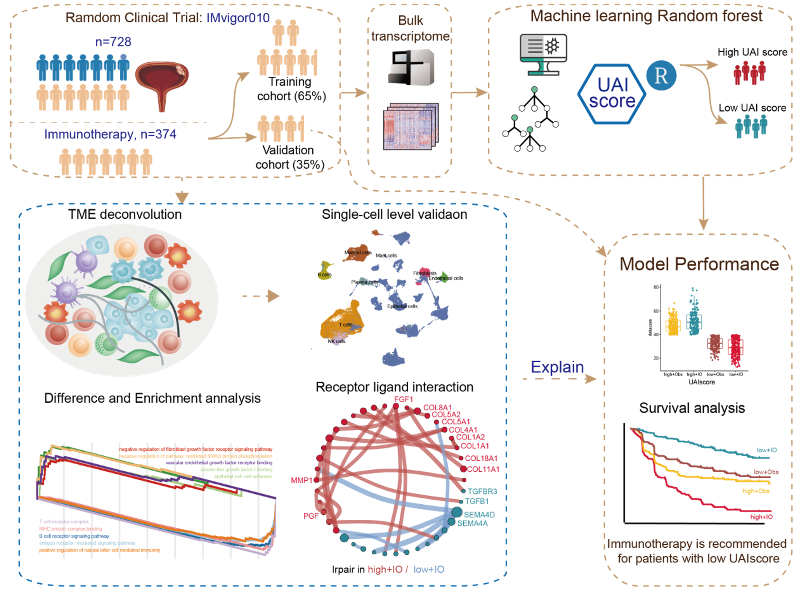
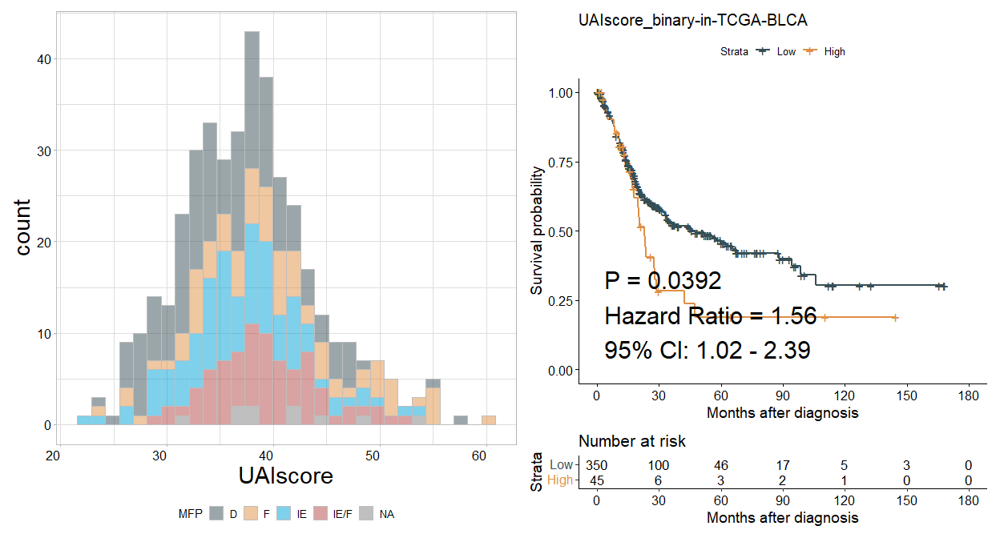

<!-- README.md is generated from README.Rmd. Please edit that file -->

# UAIscore

UAIscore is an R package for predicting the effectiveness of
immunotherapy in patients with hepatocellular carcinoma (HCC).

## 1.Introduction

1.UAIscore was developed to predict response to immunotherapy in
patients with LIHC. 2.This package consists of a random survival model
based on expression profiles of 50 genes selected by univariate Cox
regression and subgroup analysis. 3.This package provides functions for
different scenarios and allows visual assessment of whether patients are
suitable for immunotherapy.

## 2.Installation

It is essential that you already have R 3.6.3 or higher installed on
your computer or server. Before installing HIRE, please install all
dependencies by running the following command in the R console:

The dependencies include `crayon`, `ggplot2`, `randomForest`,
`randomForestSRC` and `IOBR`.

``` r
if (!requireNamespace("BiocManager", quietly = TRUE)) install.packages("BiocManager")
depens<-c("crayon", "ggplot2", "randomForest", "randomForestSRC")
for(i in 1:length(depens)){
  depen<-depens[i]
  if (!requireNamespace(depen, quietly = TRUE))   BiocManager::install(depen,update = FALSE)
}

if (!requireNamespace("IOBR", quietly = TRUE))  devtools::install_github("IOBR/IOBR")
  
```

If you have problems installing IOBR, please refer to this link in
detail:<https://github.com/IOBR/IOBR>

Then, you can start to install uaiscore from github by typing the
following code into your R session:

``` r
if (!requireNamespace("uaiscore", quietly = TRUE))
  remotes::install_github("LiaoWJLab/uaiscore")
```

#### Graphical abstract for construction and clinical application of uaiscore

<figure>

<figcaption aria-hidden="true">UAIscore-workflow.png</figcaption>
</figure>

Once the installation is complete, load the IOBR, uaiscore and tidyverse
packages into your R session:

``` r
library(uaiscore)
library(IOBR)
library(tidyverse)
```

## 3.Usage

### Here we use the TCGA-LIHC data as an example.

For transcriptomic data from TCGA datasets, we strongly recommend users
to use the UCSCXenaTools R package. Here we download count data from
TCGA-LUAD from UCSC using the UCSCXenaTools R package and process the
data using the [IOBR pipeline](https://iobr.github.io/book/).

``` r
# if (!requireNamespace("UCSCXenaTools", quietly = TRUE))
#     BiocManager::install("UCSCXenaTools")
# library(UCSCXenaTools)
# 
# eset<-XenaGenerate(subset = XenaCohorts =="GDC TCGA Bladder Cancer (BLCA)") %>%
#   XenaFilter(filterDatasets    = "TCGA-BLCA.htseq_counts.tsv") %>%
#   XenaQuery() %>%
#   XenaDownload() %>%
#   XenaPrepare()

eset<- readr::read_tsv("TCGA-BLCA.htseq_counts.tsv.gz")
#> Rows: 60483 Columns: 431
#> ── Column specification ────────────────────────────────────────────────────────
#> Delimiter: "\t"
#> chr   (1): Ensembl_ID
#> dbl (430): TCGA-2F-A9KO-01A, TCGA-2F-A9KP-01A, TCGA-2F-A9KQ-01A, TCGA-2F-A9K...
#> 
#> ℹ Use `spec()` to retrieve the full column specification for this data.
#> ℹ Specify the column types or set `show_col_types = FALSE` to quiet this message.
# Remove the version numbers in Ensembl ID.
eset$Ensembl_ID<-substring(eset$Ensembl_ID, 1, 15)
eset<-column_to_rownames(eset, var = "Ensembl_ID")
# Revert back to original format because the data from UCSC was log2(x+1)transformed.
eset<-(2^eset)-1
head(eset[1:5,1:5])
#>                 TCGA-2F-A9KO-01A TCGA-2F-A9KP-01A TCGA-2F-A9KQ-01A
#> ENSG00000000003             6092            11652             5426
#> ENSG00000000005                0                4                1
#> ENSG00000000419             3072             2656             1983
#> ENSG00000000457             1302              984             1134
#> ENSG00000000460              779              924              421
#>                 TCGA-2F-A9KR-01A TCGA-2F-A9KT-01A
#> ENSG00000000003             4383             3334
#> ENSG00000000005                1                0
#> ENSG00000000419             2061             2930
#> ENSG00000000457             1092              496
#> ENSG00000000460              386              318

#remove ajacent normal sample of TCGA-LUAD
eset<- eset[,!substring(colnames(eset), 14,16)=="11A"]
colnames(eset)<- substring(colnames(eset), 1,12)
summary(duplicated(colnames(eset)))
#>    Mode   FALSE    TRUE 
#> logical     408       3
eset<- eset[,!duplicated(colnames(eset))]
```

``` r
eset_tpm <- count2tpm(countMat = eset, idType = "Ensembl")
#> >>>--- Using variables (anno_grch38) and gene lengths (eff_length)  built into the IOBR package to perform TPM transformation
#> >>>--- The gene lengths (eff_length) was estimated by function `getGeneLengthAndGCContent` from EDASeq package with default parameters at 2023-02-10
#> Warning in count2tpm(countMat = eset, idType = "Ensembl"): >>>--- Omit 3985
#> genes of which length is not available !
#using phenotype data derived from TCGA paper [https://pubmed.ncbi.nlm.nih.gov/34019806/]
data(pdata_blca, package = "uaiscore")
summary(pdata_blca$ID%in%colnames(eset))
#>    Mode    TRUE 
#> logical     398
```

### Annotate genes in expression matrix and remove duplicate genes using [IOBR package](https://iobr.github.io/book/).

``` r
eset <- anno_eset(eset = eset, annotation = anno_grch38, probe = "id", symbol = "symbol")
#> Row number of original eset:
#> >>>>  60483
#> >>> 99.73% of probe in expression set was annotated
#> Row number after filtering duplicated gene symbol:
#> >>>>  55856
```

## Calculate riskscore of TCGA

We offer two methods to calculate the `uaiscore` score for samples in
different scenarios. One method involves calculating the score for
individual samples by inputting them into the uaiscore algorithm, while
the other method involves calculating the score for multiple samples by
inputting them together. We utilize data from the OAK studies as
reference data to help users understand the distribution of scores for
their samples.

``` r
res  <- uaiscore(eset        = eset_tpm,
                 check_eset  = T, 
                 pdata       = pdata_blca,
                 id_pdata    = "ID",
                 scale       = TRUE)
#> >>>-- Scaling data...
#> >>>-- Removing outlier genes...
#> [1] ">>> Is NA exist:  814368"
#> [1] ">>>> Is nonnumeric variables exist ? >>>>"
#>    Mode   FALSE 
#> logical   54341 
#> [1] ">>>> Is -Inf variables exist ? >>>>"
#>    Mode   FALSE 
#> logical   54341 
#> [1] ">>>> Is Inf variables exist ? >>>>"
#>    Mode   FALSE 
#> logical   54341 
#> [1] ">>> Variables with sd = 0 :  "
#>    Mode   FALSE 
#> logical   54341 
#> >>>-- Predicting new data with uaiscore model...
#> Warning: 程辑包'randomForestSRC'是用R版本4.2.3 来建造的
#> 
#>  randomForestSRC 3.2.2 
#>  
#>  Type rfsrc.news() to see new features, changes, and bug fixes. 
#> 
#> 
#> 载入程辑包：'randomForestSRC'
#> The following object is masked from 'package:purrr':
#> 
#>     partial
#> >>>-- 87.91% of model genes appear on gene matrix
#> >>>-- DONE!
res<-res$score
head(res)
#>             ID UAIscore TCGA_project HISTOLOGICAL_SUBTYPE Gender Age P_stage
#> 1 TCGA-2F-A9KO 36.04520         <NA>                 <NA>   <NA>  NA    <NA>
#> 2 TCGA-2F-A9KP 31.62862         BLCA                 BLCA      M  66  III/IV
#> 3 TCGA-2F-A9KQ 41.47669         BLCA                 BLCA      M  69  III/IV
#> 4 TCGA-2F-A9KR 33.71742         BLCA                 BLCA      F  59  III/IV
#> 5 TCGA-2F-A9KT 46.53445         BLCA                 BLCA      M  83    I/II
#> 6 TCGA-2F-A9KW 53.96109         BLCA                 BLCA      F  67  III/IV
#>   C_stage  MFP Immune Subtype TCGA Subtype os_time os_status pfs_time
#> 1      NA <NA>           <NA>         <NA>      NA        NA       NA
#> 2      NA    D             C1         <NA>     364         1      343
#> 3      NA    D             C1         <NA>    2886         0     2886
#> 4      NA    D             C1         <NA>    3183         1     3086
#> 5      NA    D             C1         <NA>    3314         0     3314
#> 6      NA    F             C4         <NA>     254         1       85
#>   pfs_status ips_ctla4_neg_pd1_neg ips_ctla4_neg_pd1_pos ips_ctla4_pos_pd1_neg
#> 1         NA                    NA                    NA                    NA
#> 2          1                     8                     6                     7
#> 3          0                     8                     6                     7
#> 4          1                     9                     7                     9
#> 5          0                     7                     5                     6
#> 6          1                     7                     6                     7
#>   ips_ctla4_pos_pd1_pos TumorPurity      TMB BCR Evenness BCR Shannon
#> 1                    NA          NA       NA           NA          NA
#> 2                     6      0.7263 3.878489    0.9568887   0.6632647
#> 3                     5      0.7019 1.804208           NA          NA
#> 4                     7      0.9164 5.924857           NA          NA
#> 5                     4      0.7019 9.606038           NA          NA
#> 6                     6      0.7913 2.659478           NA          NA
#>   BCR Richness TCR Shannon TCR Richness TCR Evenness Margin_status
#> 1           NA          NA           NA           NA          <NA>
#> 2            2          NA            0           NA          <NA>
#> 3           NA          NA            0           NA          <NA>
#> 4           NA    1.475076            5    0.9165164          <NA>
#> 5           NA    0.000000            1           NA          <NA>
#> 6           NA    1.098612            3    1.0000000          <NA>
#>   Residual_Tumor  MSI  EBV  HBV  HCV  HPV Smoking  Race              Ethnicity
#> 1             NA <NA> <NA> <NA> <NA> <NA>    <NA>  <NA>                   <NA>
#> 2             NA  MSS <NA> <NA> <NA> <NA>    Ever WHITE NOT HISPANIC OR LATINO
#> 3             NA  MSS <NA> <NA> <NA> <NA>   Never WHITE NOT HISPANIC OR LATINO
#> 4             NA  MSS <NA> <NA> <NA> <NA> Current  <NA>                   <NA>
#> 5             NA  MSS <NA> <NA> <NA> <NA> Current WHITE NOT HISPANIC OR LATINO
#> 6             NA  MSS <NA> <NA> <NA> <NA>    Ever WHITE NOT HISPANIC OR LATINO
#>                                     histological_type icd_o_3_histology
#> 1                                                <NA>              <NA>
#> 2 Muscle invasive urothelial carcinoma (pT2 or above)        8120-03-01
#> 3 Muscle invasive urothelial carcinoma (pT2 or above)        8120-03-01
#> 4 Muscle invasive urothelial carcinoma (pT2 or above)        8130-03-01
#> 5 Muscle invasive urothelial carcinoma (pT2 or above)        8120-03-01
#> 6 Muscle invasive urothelial carcinoma (pT2 or above)        8120-03-01
```

## Visualisation of results

Relationship between uaiscore score and tumour microenvironmental typing

``` r
table(res$MFP)
#> 
#>    D    F   IE IE/F 
#>  146   78   98   76
p1<- ggplot(res, aes(x= UAIscore, fill= MFP)) +
  geom_histogram(bins = 30, colour = "grey", alpha = 0.5)+
  design_mytheme(axis_angle = 0)+
  scale_fill_manual(values = palettes(palette = "jama", show_col = FALSE))
#> >>>>Options for `theme`: light, bw, classic and classic2
```

Survival analysis of uaiscore score

``` r
library(survminer)
res<- best_cutoff(pdata = res, time = "os_time", status = "os_status", variable = "UAIscore")
#> >>>-- The best cutoff is =  45.473019193873
#> $best_cutoff
#> [1] ">>>-- The best cutoff is =  45.473019193873"
#> 
#> $cox_continuous_object
#> Call:
#> coxph(formula = y ~ pdata[, which(colnames(pdata) == variable)], 
#>     data = pdata)
#> 
#>   n= 395, number of events= 170 
#> 
#>                                                coef exp(coef) se(coef)     z
#> pdata[, which(colnames(pdata) == variable)] 0.02018   1.02038  0.01168 1.727
#>                                             Pr(>|z|)  
#> pdata[, which(colnames(pdata) == variable)]   0.0842 .
#> ---
#> Signif. codes:  0 '***' 0.001 '**' 0.01 '*' 0.05 '.' 0.1 ' ' 1
#> 
#>                                             exp(coef) exp(-coef) lower .95
#> pdata[, which(colnames(pdata) == variable)]      1.02       0.98    0.9973
#>                                             upper .95
#> pdata[, which(colnames(pdata) == variable)]     1.044
#> 
#> Concordance= 0.522  (se = 0.023 )
#> Likelihood ratio test= 2.92  on 1 df,   p=0.09
#> Wald test            = 2.98  on 1 df,   p=0.08
#> Score (logrank) test = 2.98  on 1 df,   p=0.08
#> 
#> 
#> $summary_binary_variable
#> High  Low 
#>   45  350 
#> 
#> $cox_binary_object
#> Call:
#> coxph(formula = y ~ pdata[, which(colnames(pdata) == variable2)], 
#>     data = pdata)
#> 
#>   n= 395, number of events= 170 
#> 
#>                                                    coef exp(coef) se(coef)
#> pdata[, which(colnames(pdata) == variable2)]Low -0.4477    0.6391   0.2171
#>                                                      z Pr(>|z|)  
#> pdata[, which(colnames(pdata) == variable2)]Low -2.062   0.0392 *
#> ---
#> Signif. codes:  0 '***' 0.001 '**' 0.01 '*' 0.05 '.' 0.1 ' ' 1
#> 
#>                                                 exp(coef) exp(-coef) lower .95
#> pdata[, which(colnames(pdata) == variable2)]Low    0.6391      1.565    0.4176
#>                                                 upper .95
#> pdata[, which(colnames(pdata) == variable2)]Low    0.9781
#> 
#> Concordance= 0.516  (se = 0.012 )
#> Likelihood ratio test= 3.83  on 1 df,   p=0.05
#> Wald test            = 4.25  on 1 df,   p=0.04
#> Score (logrank) test = 4.32  on 1 df,   p=0.04
# help("surv_group")
p2<- surv_group(
  input_pdata     = res,
  target_group    = "UAIscore_binary",
  levels          = c("High", "Low"),
  reference_group = "High",
  project         = "TCGA-LIHC",
  time            = "os_time",
  status          = "os_status",
  time_type       = "day",
  break_month     = "auto",
  cols            = NULL,
  palette         = "jama",
  mini_sig        = "",
  save_path       = paste0("man/figures"))
#> >>> Dataset's survival follow up time is range between 0.43 to 168.33 months
#> High  Low 
#>   45  350
#> 45350
#>   Maximum of follow up time is 168.333333333333 months; and will be divided into 6 sections;
#> [1] Low  High
#> Levels: High Low

p1+p2
```



## References

1.Zeng D, Huang X, …, Liao W; UAIscore enables precise stratification of
adjuvant immunotherapy in urothelial carcinoma (2023) *Under Review*.

## Reporting bugs

Please report bugs to the [Github issues
page](https://github.com/LiaoLab/HIRE/issues)

E-mail any questions to <dongqiangzeng0808@gmail.com>
